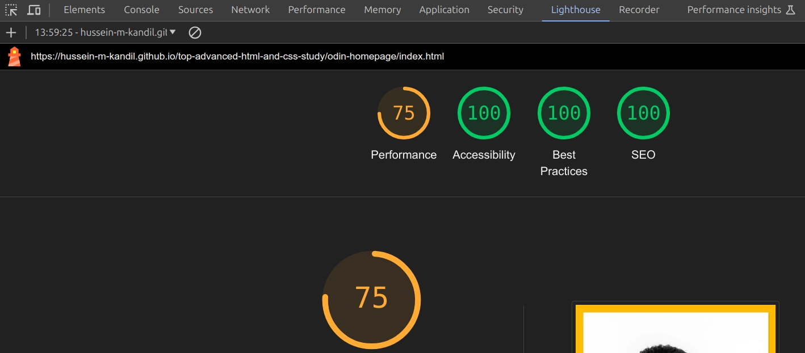
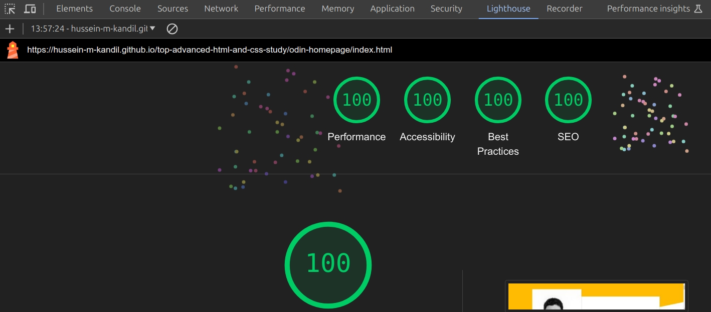

# The Odin Project Advanced HTML and CSS Study

Projects that i built while studying the [Advanced HTML and CSS Course](https://www.theodinproject.com/paths/full-stack-javascript/courses/advanced-html-and-css/) which is part of the [Full Stack JavaScript Path](https://www.theodinproject.com/paths/full-stack-javascript/) at [The Odin Project](https://www.theodinproject.com/).

## Projects' links

1. [Odin Homepage](https://hussein-m-kandil.github.io/top-advanced-html-and-css-study/odin-homepage/index.html)

### Lighthouse results for _Odin Homepage_

> _**Note** that these values are **estimated** and may vary._

- **_Mobile_**
  
- **_Desktop_**
  
